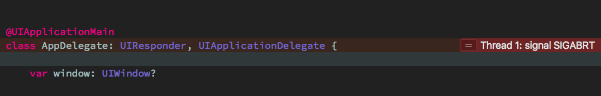
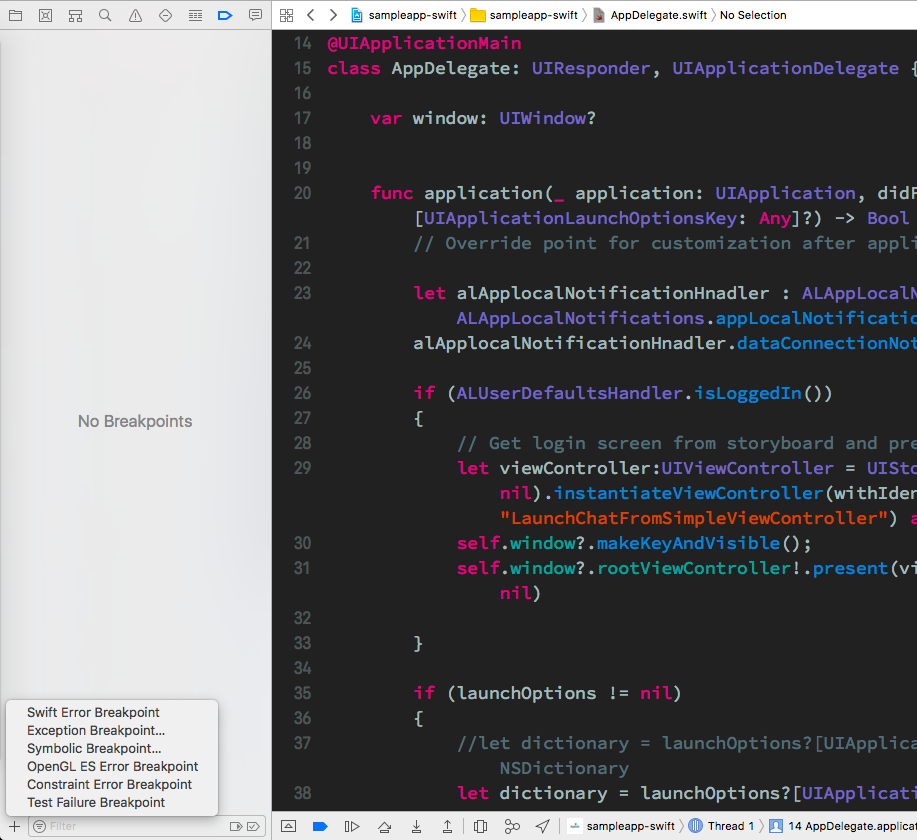
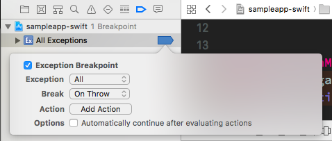
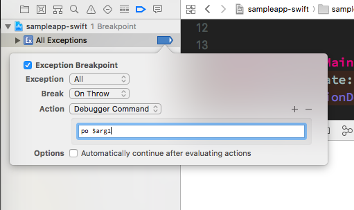
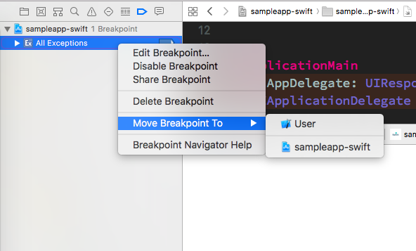
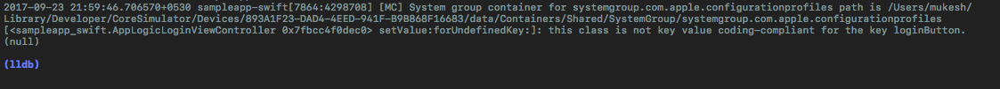

*Updated on 2017-10-12*


```
libc++abi.dylib: terminating with uncaught exception of type NSException
```
&nbsp;



These are very common errors in iOS development. By looking at this error message you can't say why are you getting this error? There were no build time errors so you are not sure what could be the reason? You want more information and Thread 1: signal SIGABRT is not helping you in debugging. In this post, I will share how I debug these errors.

It's a three step process:

### Exception Breakpoint

The first step is to add an exception breakpoint. Unlike other breakpoints, it's not something we set on a specific line and check what went wrong. Exception breakpoint will stop the execution in case of a problem in our program. From there we can check what was the reason behind that crash.

To add an exception breakpoint click on the breakpoint navigator and then on the plus button at the bottom.



&nbsp;

Once you click on the Exception Breakpoint then it will look like this:



Now it will stop whenever there is a problem. In the next step, we will see how to print the error.

### Error description

In the second step, we are going to add an action. So, edit the exception you added in the last step. Once you click on the edit button you will see the "Add Action" button, click on that. Then choose the "Debugger command" option from the list.

In the debugger command field write `po $arg1`



Now you will see the error printed on your Xcode console.

### User Breakpoints

In this step, we will place the exception breakpoint in the user breakpoint. Once you do this then it will be available for all your projects. 🚀

To place the exception breakpoint in the user breakpoint, right click on the exception and select "Move Breakpoint To" then tap "User" and it's done. Now you can check your other projects, it will be present in all your projects.



That's it. Now whenever an error occurs, it will stop and you will see the error printed on your Xcode console.




There are some other breakpoints which you should add in all yours projects. I recommend reading [this](https://pspdfkit.com/blog/2017/user-breakpoints-in-xcode/) blog post by Michael Ochs on different breakpoints.
