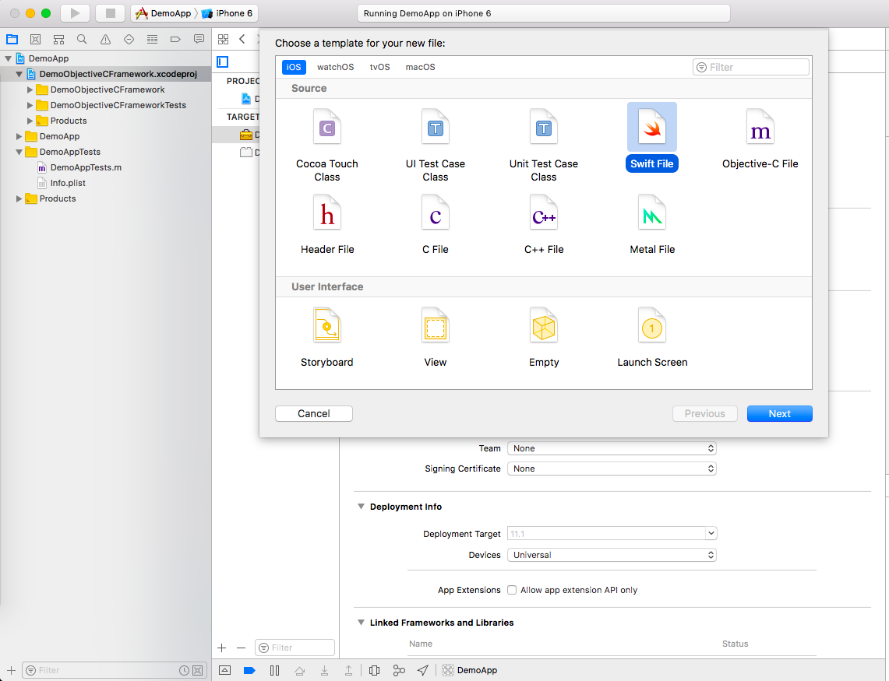
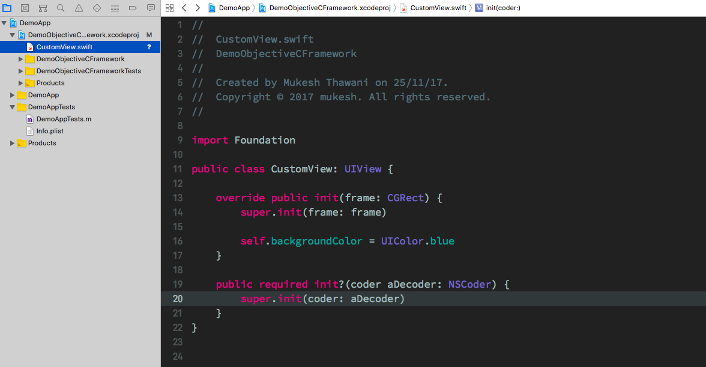
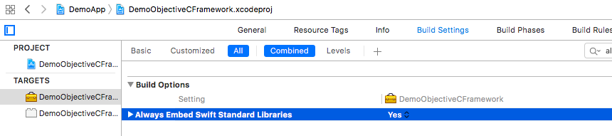
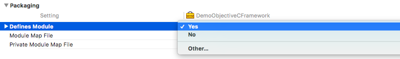
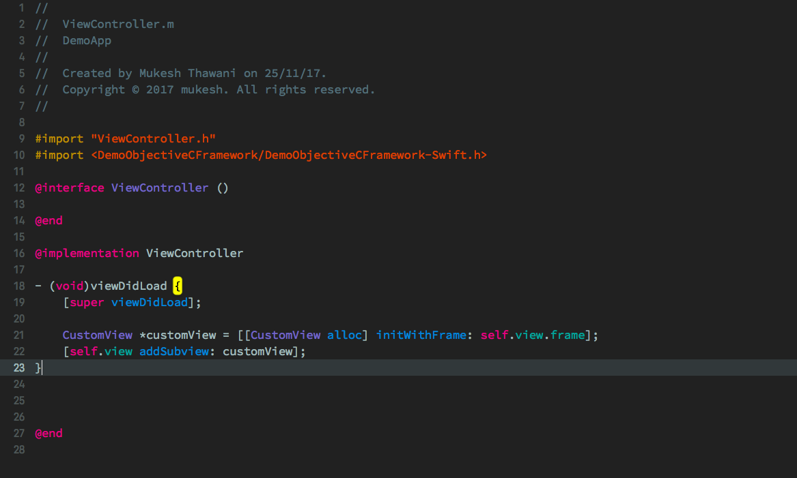

I have an Objective-C framework which I started before Swift came out and it works fine. I decided that I will use Swift for any new feature that I am going to add. So, the question is, How to use Swift code in an Objective-C framework? You might think that I will get a lot of results when I search it on Google but that was not the case, most of the results are for adding Swift code in an Objective-C project, not a framework. I thought I should share the details of how I did it. So, let's start.

### Adding Swift File

First Step is to add a new Swift file in an Objective-C framework. Remember to add it to the Framework not project.

Once that gets done, then we can add our Swift code to that file. For example, let's create a view and change its background color:

Note: If it's an Objective-C project then a popup window will appear for adding a bridging-header but not in the framework. I wasted a lot of time in this as I read it in many forums and blog posts that you get a popup. I even created a bridging-header manually but, it's not required.

### Build Settings

Next step is to change this setting: `Always Embed Swift Standard Libraries` to `Yes` in the target's build settings.

After that change, this setting `Defines Modules` to `Yes` if it is `No`. It is present in the Packaging section of target's build settings.

Now the framework and the project both should build successfully.

### Using Swift Code

The import statement in the objective-c file, where we are using the Swift code, should be like this:

`#import <ModuleName/ModuleName-Swift.h>`

It will be same when using the Swift file outside the framework. This(`ModuleName-Swift.h`) header file contains an interface for all Swift declarations.

Now we can initialize the class which we created in the Swift file.

### Interoperability

Before we call the Swift code in an Objective-C file, keep in mind not everything is accessible. We can access the Swift declarations marked with the public or open modifier.

Not all the Swift features will work. Read more on that on Apple's [docs](https://developer.apple.com/library/content/documentation/Swift/Conceptual/BuildingCocoaApps/InteractingWithObjective-CAPIs.html)

You can get the example project from this [link](https://github.com/mukeshthawani/Swift-Objc-framework)
